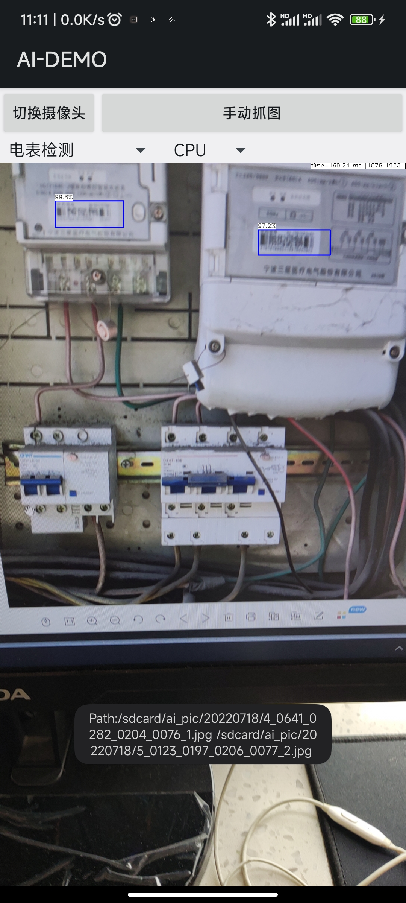

# ncnn-android-scrfd

AiMobile includes the following detection tasks:
人脸检测
电瓶车检测
车牌识别
电表检测
and you can add extra tasks by modilfing the \app\src\main\res\layout\main.xml.
This is a sample ncnn android project, it depends on ncnn library and opencv

https://github.com/Tencent/ncnn

https://github.com/nihui/opencv-mobile

## android apk file download
链接：https://pan.baidu.com/s/1hjP6HKUOC89DR1fVh7haoA 
提取码：kze1 

## how to build and run
the following files can be downloaded in 
链接：https://pan.baidu.com/s/1KvYDd0ah8aD_VOSukGHjjQ 
提取码：qh0o 

### step1
https://github.com/Tencent/ncnn/releases

* Download ncnn-YYYYMMDD-android-vulkan.zip or build ncnn for android yourself
* Extract ncnn-YYYYMMDD-android-vulkan.zip into **app/src/main/jni** and change the **ncnn_DIR** path to yours in **app/src/main/jni/CMakeLists.txt**

### step2
https://github.com/nihui/opencv-mobile

* Download opencv-mobile-XYZ-android.zip
* Extract opencv-mobile-XYZ-android.zip into **app/src/main/jni** and change the **OpenCV_DIR** path to yours in **app/src/main/jni/CMakeLists.txt**

### step3
* Open this project with Android Studio, build it and enjoy!

## some notes
* Android ndk camera is used for best efficiency
* Crash may happen on very old devices for lacking HAL3 camera interface
* All models are manually modified to accept dynamic input shape
* Most small models run slower on GPU than on CPU, this is common
* FPS may be lower in dark environment because of longer camera exposure time

## screenshot

